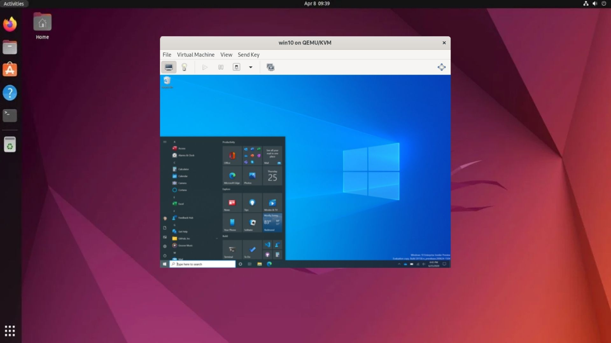

# Windows en Docker con Libvirt
Este proyecto permite configurar y ejecutar una máquina virtual de Windows dentro de un contenedor Docker utilizando Libvirt. Con esta configuración, puedes desplegar un entorno gráfico de Windows para pruebas, desarrollo o uso personal sin necesidad de configuraciones complejas de máquinas físicas.

Por favor, lee todo el README antes de comenzar para asegurarte de que cumples con los requisitos y entiendes el proceso.



Requisitos
Docker y Docker Compose instalados en tu máquina.
Un host con soporte para virtualización (Intel VT-x, AMD-V).
Espacio suficiente en disco para almacenar la máquina virtual y los archivos relacionados.
Conexión a internet para descargar los recursos necesarios.
Instalación
# 1. Descargar el repositorio
Clona este repositorio en tu máquina:

```
git clone https://github.com/nuntius-dev/virtio-win.git
```
&nbsp;
# 2. Configurar Docker Compose
Edita el archivo docker-compose.yml si necesitas personalizar rutas, puertos o variables de entorno.
```
services:
  libvirt:
    restart: always
    image: msjpq/windows-in-docker:latest
    security_opt:
      - apparmor=unconfined
    environment:
      TZ: "America/Bogota"  # tu zona horaria
      DATA_DIR: "/data"  # Directorio para guardar datos
    ports:
      - 8081:8080  # Puerto para la interfaz gráfica cambie segun gustos o ocupados
    volumes:
      - /var/run/libvirt/libvirt-sock:/var/run/libvirt/libvirt-sock:ro
      - "/home:/data"
      command: /bin/bash -c "if [ ! -f /data/virtio-win.iso ]; then curl -L https://fedorapeople.org/groups/virt/virtio-win/direct-downloads/stable-virtio/virtio-win.iso -o /data/virtio-win.iso; else echo 'virtio-win.iso already exists'; fi"
```
&nbsp;
# 3. Ejecutar el contenedor
Lanza el contenedor con Docker Compose:

```
docker-compose up -d
```
&nbsp;
Durante la configuración inicial, el contenedor descargará automáticamente el archivo virtio-win.iso requerido para la instalación de Windows. Si el archivo ya existe, se omitirá la descarga.

# Uso
Acceso a la Interfaz Gráfica
Una vez que el contenedor esté en ejecución, accede a la interfaz gráfica a través de tu navegador en la URL:

```
http://localhost:8081
```
&nbsp;
Sigue las instrucciones en pantalla para configurar y ejecutar tu máquina virtual de Windows.

# Archivos Persistentes
Los datos persistentes se almacenan en el directorio configurado en DATA_DIR. Esto incluye archivos como imágenes ISO, configuraciones de máquinas virtuales y discos virtuales.

Por defecto, este directorio está mapeado a /home en el host. Asegúrate de tener suficiente espacio en este directorio antes de iniciar el contenedor.

# Personalización
Variables de Entorno
Puedes personalizar el contenedor utilizando las siguientes variables de entorno en el archivo docker-compose.yml:

TZ: Zona horaria del contenedor (por ejemplo, America/Bogota).
DATA_DIR: Directorio para guardar los datos persistentes.
Puertos
El puerto predeterminado para la interfaz gráfica es 8080. Puedes cambiarlo en el archivo docker-compose.yml si está en conflicto con otros servicios.

# Solución de Problemas
Archivo virtio-win.iso ya existe
El contenedor incluye un mecanismo para evitar descargar el archivo virtio-win.iso si ya está presente en la ruta de datos configurada.

Si prefieres forzar la descarga, elimina manualmente el archivo existente:

```
rm /data/virtio-win.iso
```
&nbsp;
Luego, reinicia el contenedor.

# Contribuciones
Este proyecto está en constante desarrollo. Si tienes sugerencias, encuentras errores o deseas contribuir, por favor abre un issue o envía un pull request en el repositorio.
o contacta al desarollador principal https://github.com/virtio-win

¡Gracias por usar Windows en Docker con Libvirt! Si encuentras útil este proyecto, no olvides darle una estrella ⭐ en GitHub.
